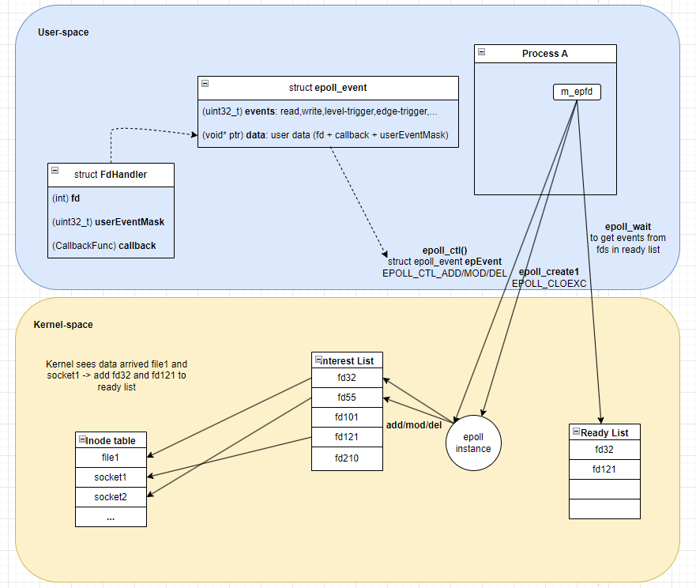

# Event Loop
Event Loop is basically a infinite loop. Our entire implementation is based on epoll and File Descriptor.
So, before get starting you may need to go through what is epoll and file descriptor, how they really work.
You can utilize the references at the end.

## Event Loop does:
1. Create an instance of epoll and manpulate it under a file descriptor m_epfd.
2. Add, modify and remove FDs from the interest list which is managed by the epoll instance. 
1. Managing our list of FdHandler in our side which is associated with respective FDs in the interest list
in kernel side.
2. Continuously wait for epoll_event using epoll_wait() system call. When kernel notices any FDs in the interest list
which is linked to respective inode in inode table (every inode represents for a file,a socket,...
"everything in Linux is a file") is "ready" for user-application to perform I/O operations on it (read/write), kernel
will put the FD into the Ready list. System call epoll_wait() can be used to retrieve them.
3. Handle those epoll_event by calling callback functions corresponding to proper FDs.

## References:
1. [epoll](https://copyconstruct.medium.com/the-method-to-epolls-madness-d9d2d6378642)
2. [file descriptor](https://copyconstruct.medium.com/nonblocking-i-o-99948ad7c957)
3. [epoll-lang-chinese](https://hackmd.io/@eric88525/epoll-intro)
